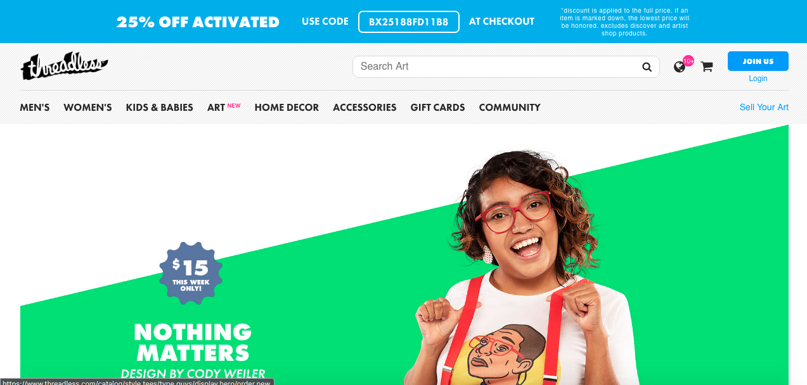
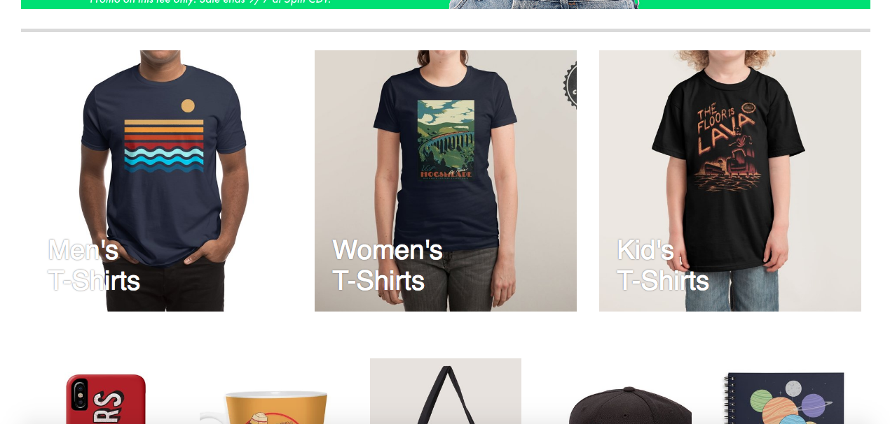

# Threadless Clone

#### A clone of the Threadless site, September 7, 2018

#### By Josh Gearheart

## Description
This is my clone of the site for [threadless.com](threadless.com).  It is still a work in progress.

### Comparisons

**Clone:**

**Real Site**

**Clone:**

**Real Site**

**Clone:**

**Real Site**

**Clone:**

**Real Site**

## Setup/Installation Requirements
- Navigate to `https://github.com/gearjosh/fond-o-clone`.
- Click the green `Clone or download` button on the right, and select `Download ZIP`.
- Unzip `fond-o-clone-master.zip`.
- Navigate to the `fond-o-clone-master` directory.
- Inside  double-click on `index.html`.

## Known Bugs
- The clone does not have the full functionality of the real site.  Menus, buttons, and links do not function.

## Support and contact details
- For questions or support you can email me at: comedian.sean.connery@gmail.com.

## Technologies Used
- This site uses HTML and CSS.

### License
This software is licensed under [GNU GPLv3](LICENSE.txt).
